# ELK-PFSENSE

## 1.Install elasticsearch.

1. Install elasticsearch from apt (Just search on google).
2. Enable elasticsearch to run as service:

```
sudo systemctl daemon-reload
sudo systemctl enable elasticsearch.service
```

3. Locate to `/usr/share/elasticsearch/bin/elasticsearch-create-token -s node ` to generate token for node enrollment.
4. Locate to `/usr/share/elasticsearch/bin/elasticsearch-create-token -s kibana ` to generate token for kibana enrollment.
5. Edit needed information in the file `/etc/elasticsearch/elasticsearch.yml` (this step maybe require changing file permission of folder or editting under root's right)
   Change the following varibale:

```
cluster.name: demo
network.host: 100.87.243.59
http.host: 0.0.0.0
transport.host: 0.0.0.0
```

Noted that data and logs are stored in the following file:

> /var/lib/elasticsearch
> /var/log/elasticsearch 6. Noted that in the second node need to do this actions `sudo /usr/share/elasticsearch/bin/elasticsearch-reconfigure-node --enrollment-token <enrollment-token>` 7. Install successfully elasticsearch.
> 

**Default account**:elastic
Password: tRZfgFvq+6bzGBh+aqAE
Updated: password: elastic123.

## 2. Install Kibana.

Back to the elasticsearch node and generate token using:

```
/usr/share/elasticsearch/bin/elasticsearch-create-enrollment-token -s kibana
```

> The result is:
> 

1. Install kibana as guided through google (Just search installing Kibana) 

2.

```
sudo systemctl daemon-reload
sudo systemctl enable kibana.service
```

3. Edit `etc/kibana/kibana.yml `
4. Back to elastic server to generate kibana enrollment token.
5. Enable elasticsearch to run as a service.

```
sudo systemctl daemon-reload
sudo systemctl enable kibana.service
```

6. Edit file `/etc/kibana/kibana.yml`
   Keys to edit:

```
server.host: the current ip address of the server
```

7. Start kibana `sudo systemctl start kibana.service `
8. http://ip_address:5601/code=`code` (Node that this code get by run systemctl status) .

http://100.71.164.21:5601

9. Result: 
> 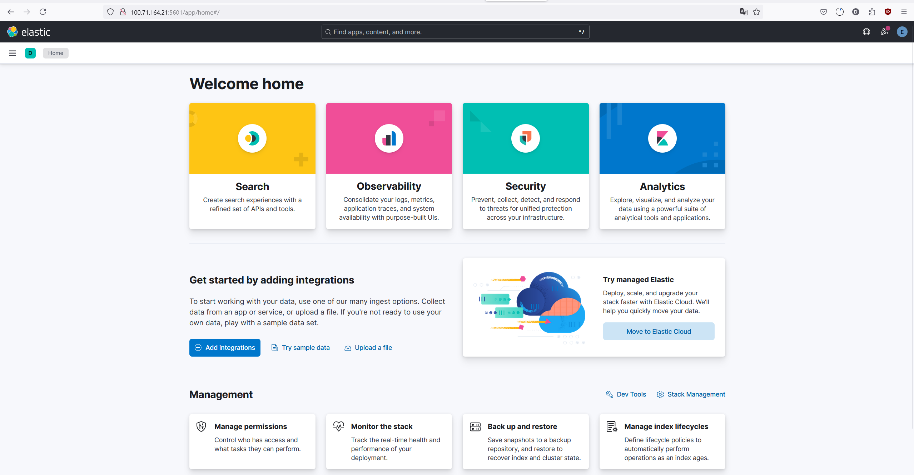

### 3. Install Fleet Server

1. Navigate to fleet in kibana dashboard.
2. Do the step as guided in the dashboard.
   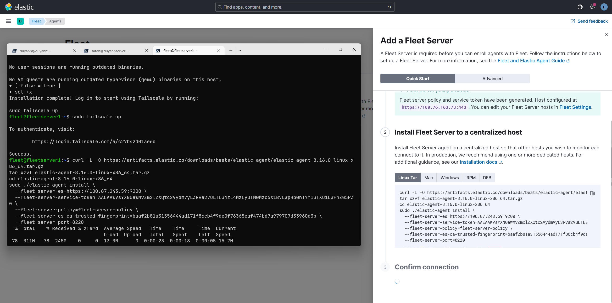
3. Result
   > 

### 4. Add agent.

1. Install agent.
   
2. Turn on pfsense firewall and the server behind it.
   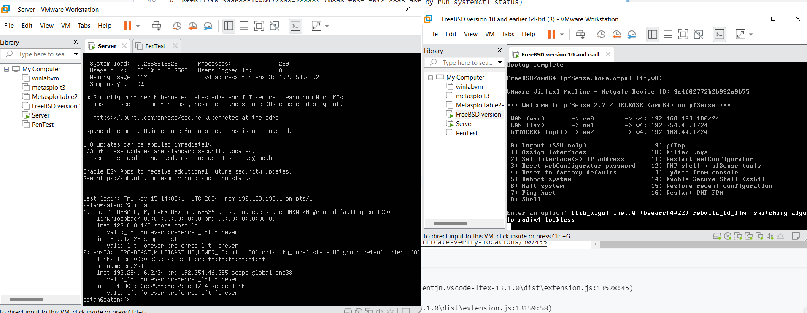
3. Install agent.
   

### 5. Add rule.

Engine priviliged error.


Link to fix: https://www.elastic.co/guide/en/security/current/detections-permissions-section.html .

Install and enable two rule "Potential SYN-Based Network Scan detected" and "Potential Network Scan detected"

Demo by pingint from kali linux vm to an ubuntu server:


> Result:
> 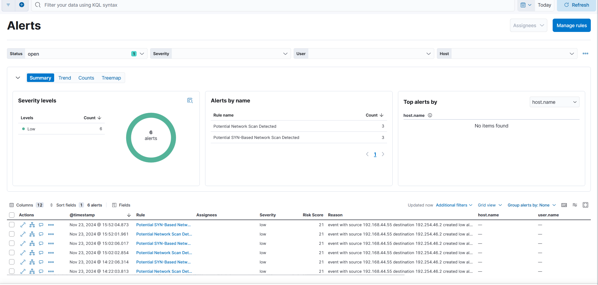

#### There are some necessary command that I have learn:

```
ss -tuln | grep -E ':443|:9001'
```

to check whether those port is opening or not.

edit file: /etc/rsyslog.conf to open collect log at port 9001


firewall@forwarder:/var/log$ tail -n 10 syslog

use this to see newest log

## Setup pfsense

1. Install iso disk from the netgate page.
2. Then cofigure vmnet host-only in vmare.
3. The wan interface will receive internet through the real machine. Unable dhcp in all interfaces, we can enable them later.
4. There will be 2 LAN network.
5. From pfsense, send logs to elk.
6. Navigate to Status/System Logs/ Settings.
   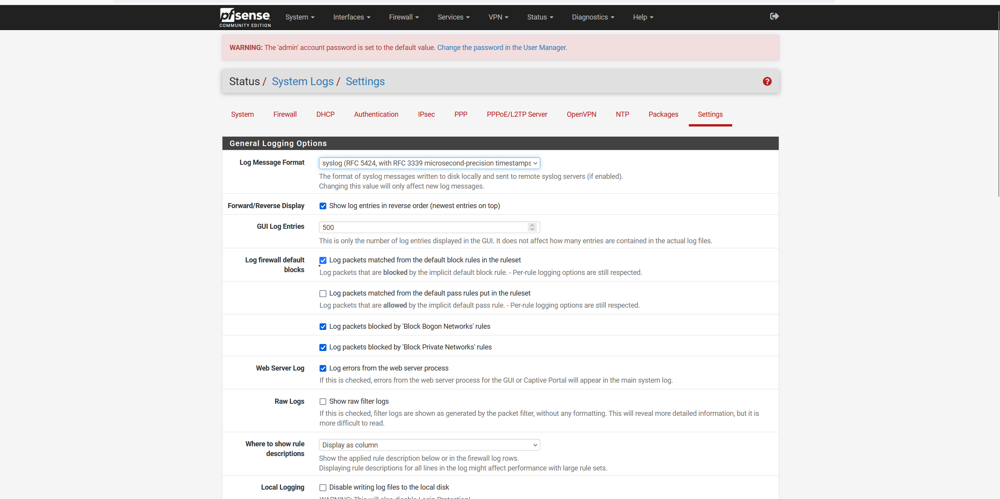

- Change Log message format to syslog.
- Enable send log to remote syslog server
- Enter ip address of remote syslog host and port, here choose another elastic agent as remote syslog server and ports for sending logs are: 443,9001, 5601 and then select send everything.
- Edit pfsense intergration.
  

## Rules detection in some usecases

1. Detect clearing Windows log.

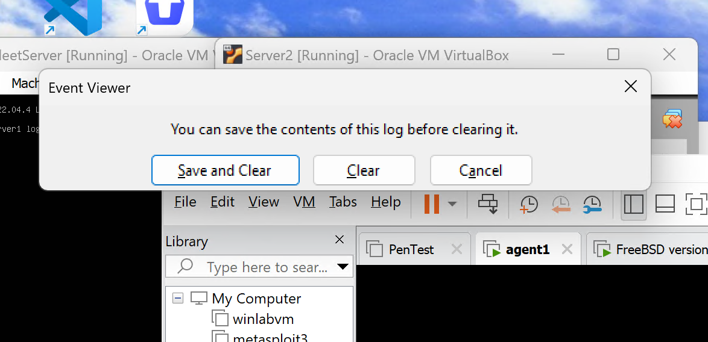

> Result:
> 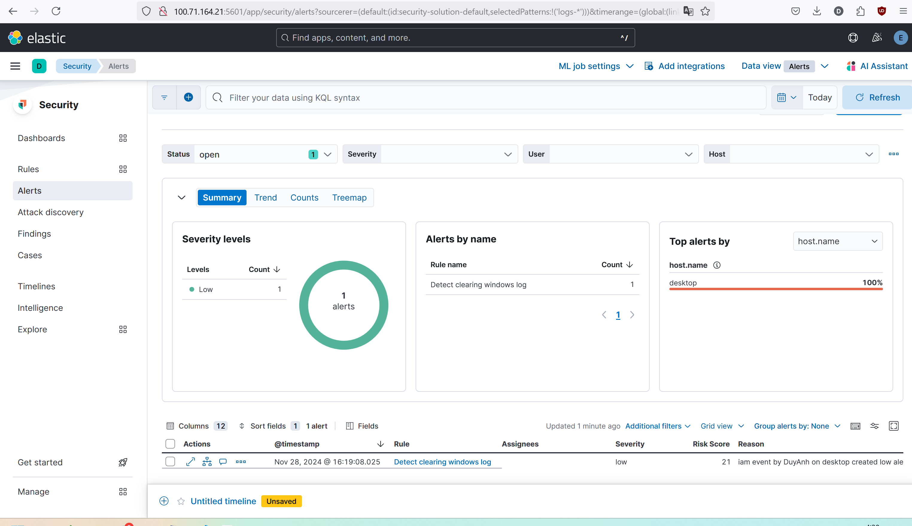

Set the rule so that it will alert when event.log = "1102"
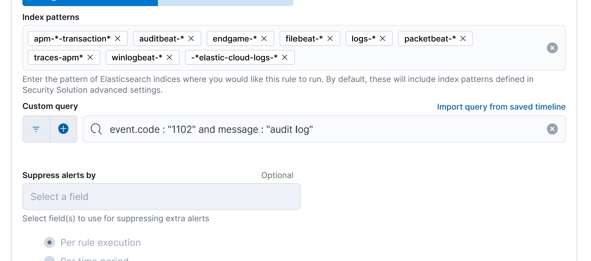

- Detect clearing **Linux** logs.
  Set the KQL query as: `process.name: "rm" and process.args: ("-rf" or "-f" or "/var/log" or "*.log") `


> Result:
> 

2. Detect adding new user.

- In Windows.
  Set rule to detect event ID :
  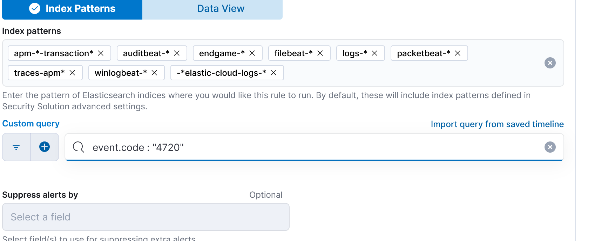

> Result:
> 

- In Linux.
  
  Set rule to detect log from `auth.log` file with message : "group added"
  > Result:
  > 

3. Detect login as administrator.

- In linux
  - Setup the custom query: `log.file.path :"/var/log/auth.log" and message : "user root" and message : "opened" `

> Result:
> 

- In Windows:
  - Setup the custom query: `   event.code : "4672" and message : "Special privileges assigned to new logon"`

> Result:
> 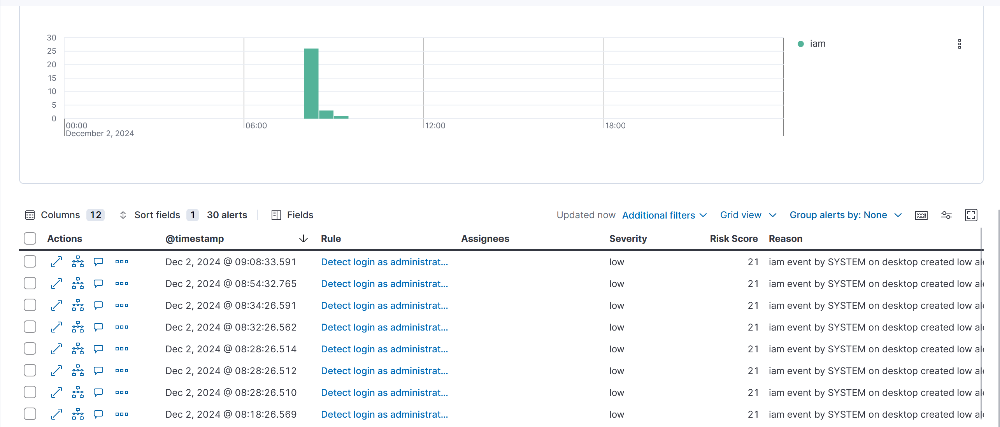

4. Detect suspicous outbound traffic.

- Setup the custom query: `network.protocol :"tls" `
  > Result:
  > 
- **Detect all outbond connection from the machine:**
  - To detect these kind of connection, we need to set the rule to catch all the log that have the private source ip address: 10.0.0.0/8; 172.16.0.0/12; 192.168.0.0/16.
  - Next we need to set the rule to detect all destination that are not inclued in the following ranges:
    10.0.0.0/8
    127.0.0.0/8
    169.254.0.0/16
    172.16.0.0/12
    192.0.0.0/24
    192.0.0.0/29
    192.0.0.8/32
    192.0.0.9/32
    192.0.0.10/32
    192.0.0.170/32
    192.0.0.171/32
    192.0.2.0/24
    192.31.196.0/2
    192.52.193.0/2
    192.168.0.0/16
    192.88.99.0/24
    224.0.0.0/4
    100.64.0.0/10
    192.175.48.0/2
    198.18.0.0/15
    198.51.100.0/2
    203.0.113.0/24
    240.0.0.0/4
    "::1"
    "FE80::/10"
    "FF00::/8"
- Setup the rule:
  Set the KQL as :
  ```
  source.ip:(
   10.0.0.0/8 or
   172.16.0.0/12 or
   192.168.0.0/16
  ) and
  not destination.ip:(
   10.0.0.0/8 or
   127.0.0.0/8 or
   169.254.0.0/16 or
   172.16.0.0/12 or
   192.0.0.0/24 or
   192.0.0.0/29 or
   192.0.0.8/32 or
   192.0.0.9/32 or
   192.0.0.10/32 or
   192.0.0.170/32 or
   192.0.0.171/32 or
   192.0.2.0/24 or
   192.31.196.0/24 or
   192.52.193.0/24 or
   192.168.0.0/16 or
   192.88.99.0/24 or
   224.0.0.0/4 or
   100.64.0.0/10 or
   192.175.48.0/24 or
   198.18.0.0/15 or
   198.51.100.0/24 or
   203.0.113.0/24 or
   240.0.0.0/4 or
   "::1" or
   "FE80::/10" or
   "FF00::/8"
  )
  ```
  

> Result:
> 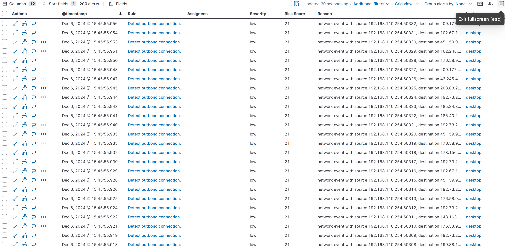

- \*\*Detect SMB outbond traffic

1. Turn on SMB in local machine.
   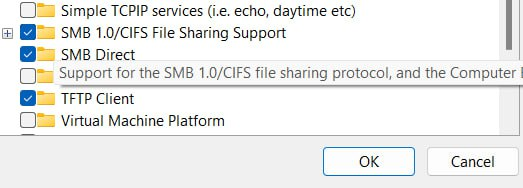
2. From another machine, access to the above machine to open a folder remotely.
   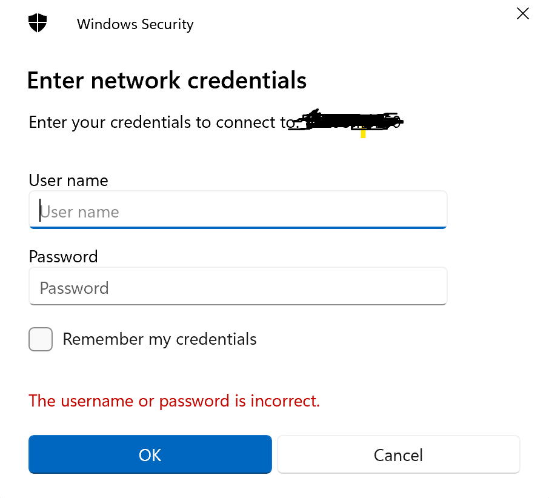
3. Set the rule to detect
   `destination.port:(139 or 445)`

> Result:
> 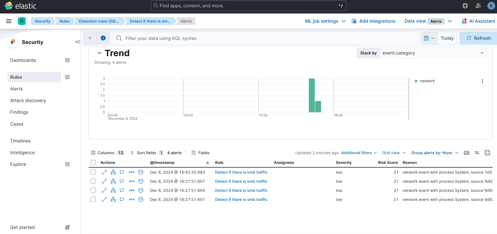

4. Monitor for activities such as brute force by login by malware.

- Set the query: `log.file.path :"/var/log/auth.log" and message : "user root" and message : "opened" `


This alert will be triggered when there are more than 5 login attemp, here we cannot set during any time period due to lack of license.

## Configure cluster elasticsearch 
1. Install elasticsearch in the second node.
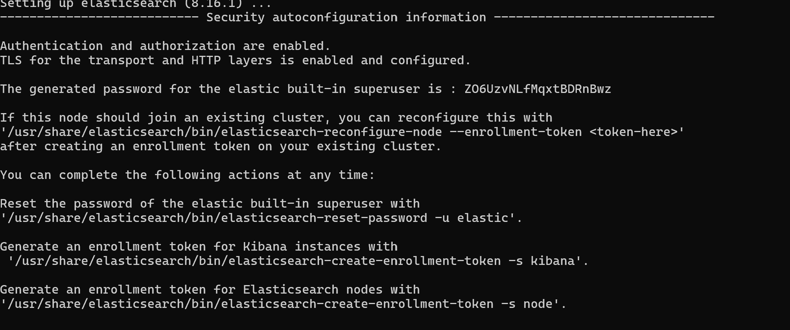

2. Generate token from the first elasticsearch node.
- In the first node, locate to the folder `/usr/share/elasticsearch/bin/` and use the following tools to generate enrollment token `/usr/share/elasticsearch/bin/elasticsearch-create-enrollment-token -s node`


- In the second node, locate to the folder `/usr/share/elasticsearch/bin/ ` and use the tool `sudo elasticsearch-reconfigure-node --enrollment-token <enrollment token> `.


- In the second node, locate to the folder `/etc/elasticsearch ` and edit the configuration file `elasticsearch.yml`.
```
cluster.name: demo
network.host: 100.95.217.67
http.host: 0.0.0.0
transport.host: 0.0.0.0
```


## Some good reference.

1. https://discuss.elastic.co/t/new-install-error-setting-certificate-verify-locations/307455
2. https://www.elastic.co/guide/en/elastic-stack/8.13/installing-stack-demo-self.html#install-stack-self-elasticsearch-first
3. PFSENSE - ELASTIC: https://www.elastic.co/docs/current/integrations/pfsense
4.
