## Report

### 1.Install elasticsearch.

1. Install elasticsearch from apt (Just search on google).
2. Enable elasticsearch to run as service:

```
sudo systemctl daemon-reload
sudo systemctl enable elasticsearch.service
```

3. Locate to `/usr/share/elasticsearch/bin/elasticsearch-create-token -s node ` to generate token for node enrollment.
4. Locate to `/usr/share/elasticsearch/bin/elasticsearch-create-token -s kibana ` to generate token for kibana enrollment.
5. Edit needed information in the file `/etc/elasticsearch/elasticsearch.yml` (this step maybe require changing file permission of folder or editting under root's right)
   Change the following varibale:

```
cluster.name: demo
network.host: 100.87.243.59
http.host: 0.0.0.0
transport.host: 0.0.0.0
```

Noted that data and logs are stored in the following file:

> /var/lib/elasticsearch
> /var/log/elasticsearch 6. Noted that in the second node need to do this actions `sudo /usr/share/elasticsearch/bin/elasticsearch-reconfigure-node --enrollment-token <enrollment-token>` 7. Install successfully elasticsearch.
> 

**Default account**:elastic
Password: tRZfgFvq+6bzGBh+aqAE
Updated: password: elastic123

### 2. Install Kibana.

Back to the elasticsearch node and generate token using:

```
/usr/share/elasticsearch/bin/elasticsearch-create-enrollment-token -s kibana
```

> The result is:
> 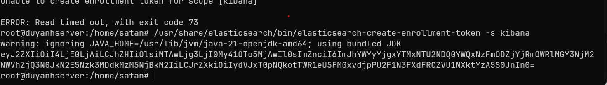

1. Install kibana as guided through google (Just search installing Kibana)
2.

```
sudo systemctl daemon-reload
sudo systemctl enable kibana.service
```

3. Edit `etc/kibana/kibana.yml'
4. Back to elastic server to generate kibana enrollment token.
5. Enable elasticsearch to run as a service.

```
sudo systemctl daemon-reload
sudo systemctl enable kibana.service
```

6. Edit file `/etc/kibana/kibana.yml`
   Keys to edit:

```
server.host: the current ip address of the server
```

7. Start kibana `sudo systemctl start kibana.service`
8. http://ip_address:5601/code=<code> (Node that this code get by run systemctl status)
   http://100.71.164.21:5601
9. Result:
   > 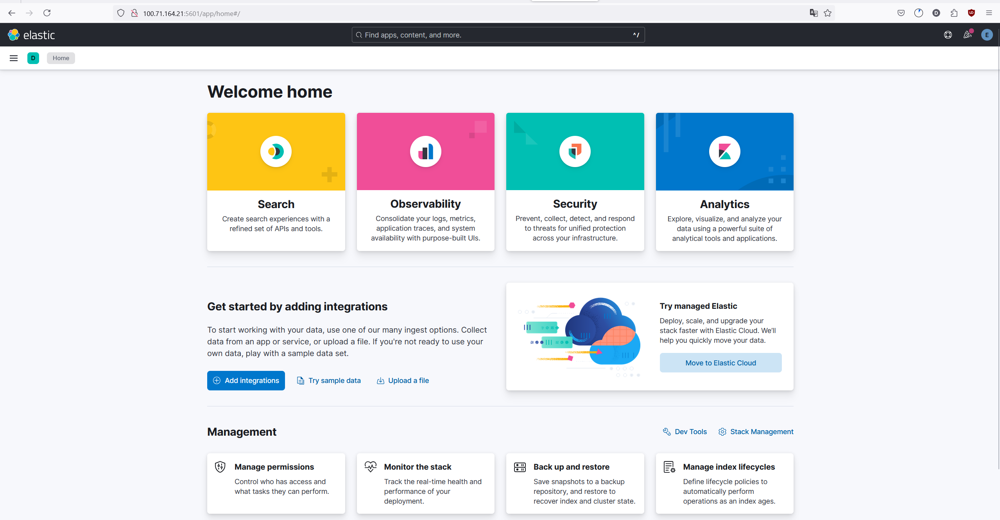

### 3. Install Fleet Server

1. Navigate to fleet in kibana dashboard.
2. Do the step as guided in the dashboard.
   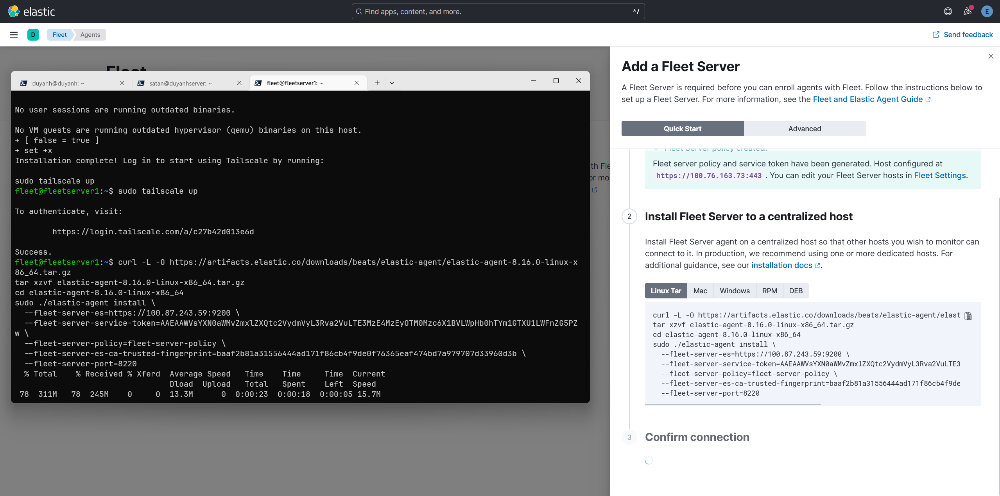
3. Result
   > 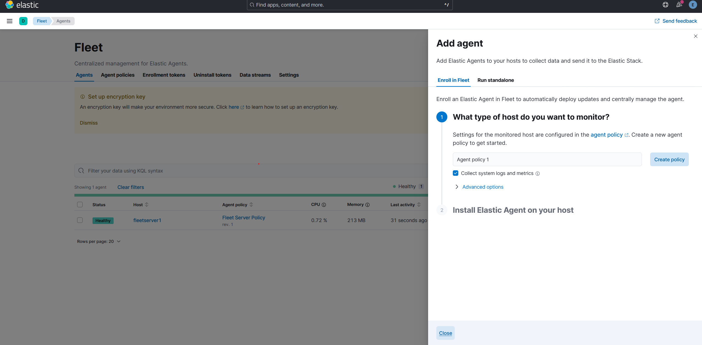

### 4. Add agent.

1. Install agent.
   
2. Turn on pfsense firewall and the server behind it.
   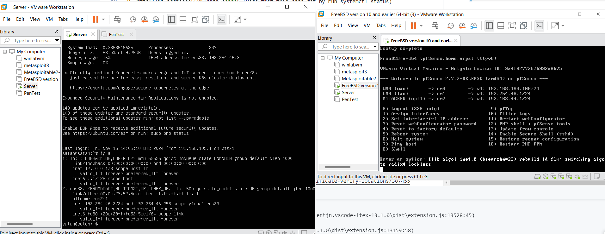
3. Install agent.
   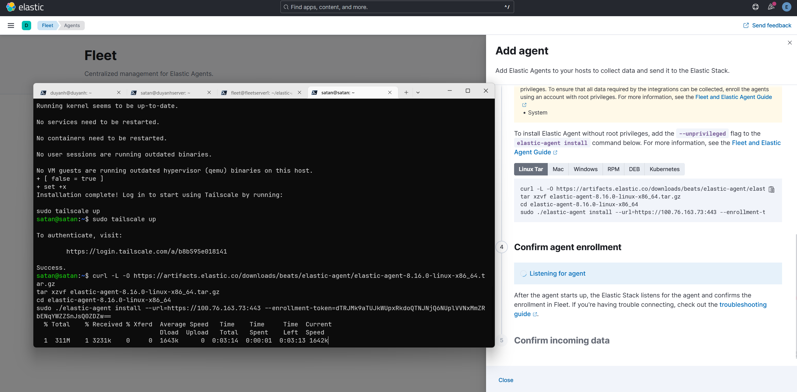

### 5. Add rule.

Engine priviliged error.
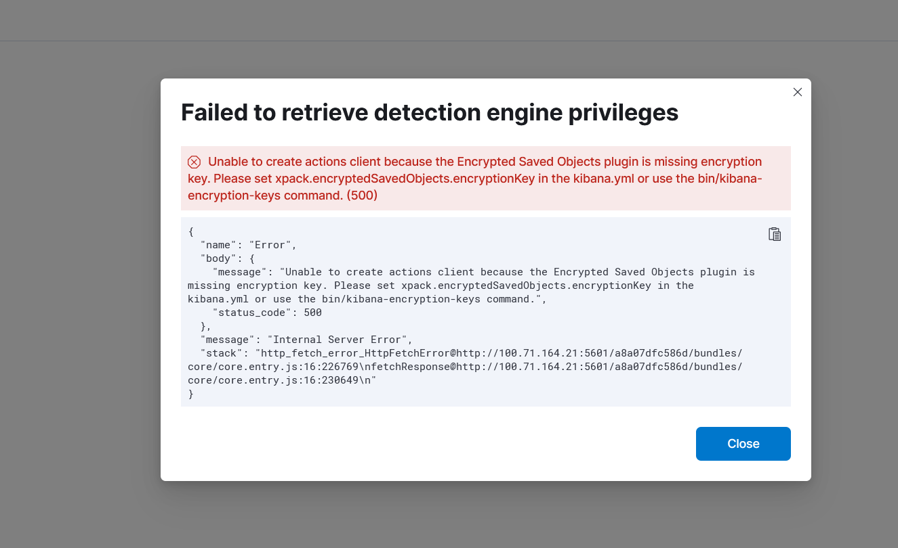

Link to fix: https://www.elastic.co/guide/en/security/current/detections-permissions-section.html .

Install and enable two rule "Potential SYN-Based Network Scan detected" and "Potential Network Scan detected"

Demo by pingint from kali linux vm to an ubuntu server:
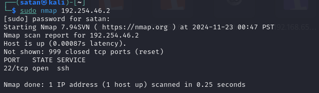

> Result:
> 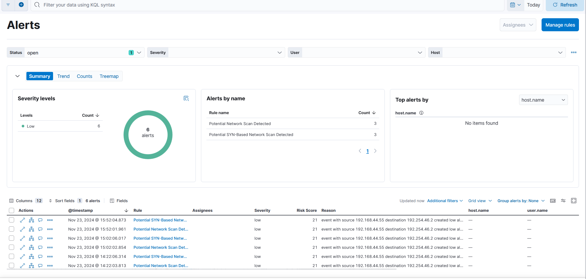

#### There are some necessary command that I have learn:

```
ss -tuln | grep -E ':443|:9001'
```

to check whether those port is opening or not.

```
edit file: /etc/rsyslog.conf to open collect log at port 9001
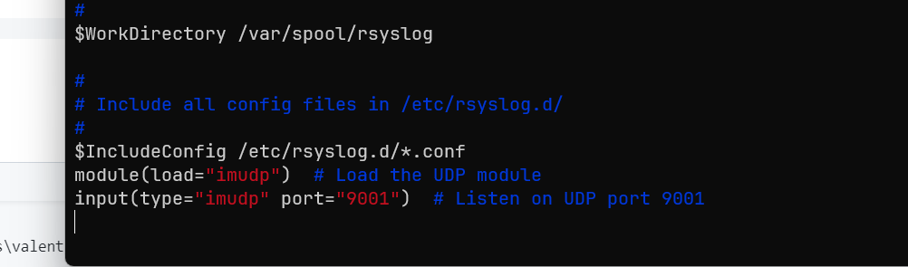

```

firewall@forwarder:/var/log$ tail -n 10 syslog

```
use this to see newest log


## Setup pfsense

1. Install iso disk from the netgate page.
2. Then cofigure vmnet host-only in vmare.
3. The wan interface will receive internet through the real machine. Unable dhcp in all interfaces, we can enable them later.
4. There will be 2 LAN network.
5. From pfsense, send logs to elk.
6. Navigate to Status/System Logs/ Settings.
   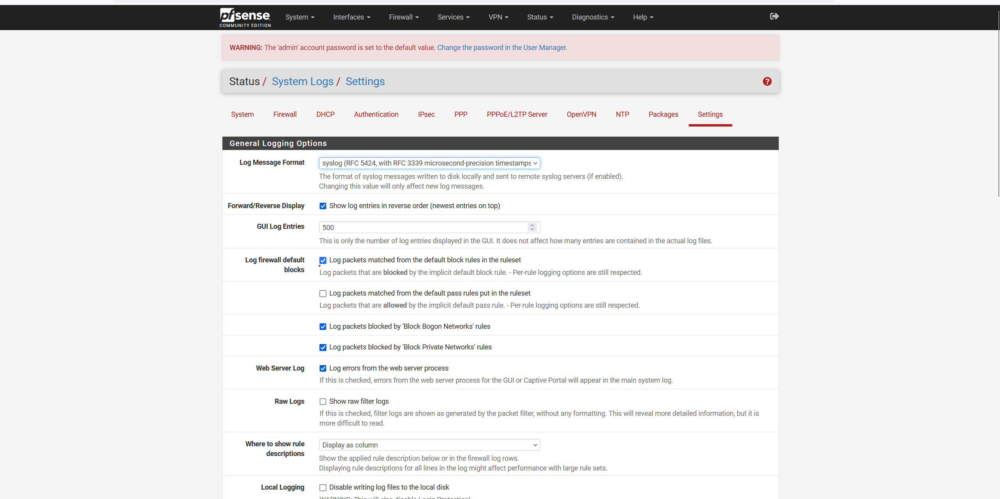

- Change Log message format to syslog.
- Enable send log to remote syslog server
- Enter ip address of remote syslog host and port, here choose another elastic agent as remote syslog server and ports for sending logs are: 443,9001, 5601 and then select send everything.
- Edit pfsense intergration.
  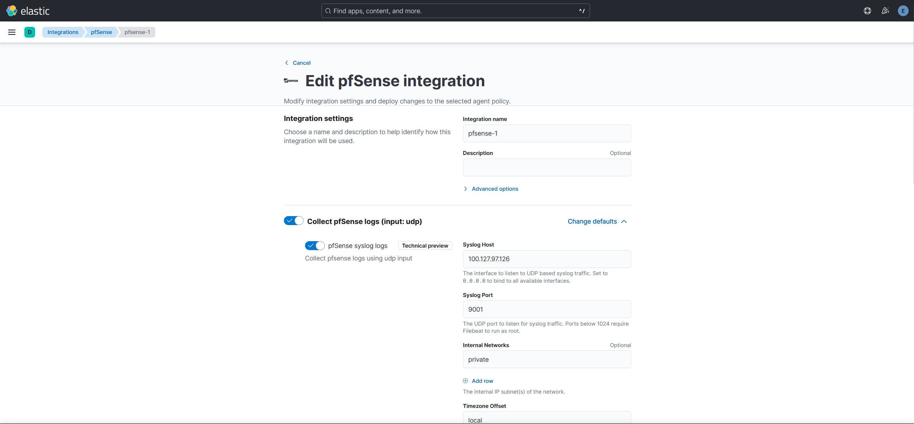

## Some good reference.

1. https://discuss.elastic.co/t/new-install-error-setting-certificate-verify-locations/307455
2. https://www.elastic.co/guide/en/elastic-stack/8.13/installing-stack-demo-self.html#install-stack-self-elasticsearch-first
3. PFSENSE - ELASTIC: https://www.elastic.co/docs/current/integrations/pfsense
4.
```
